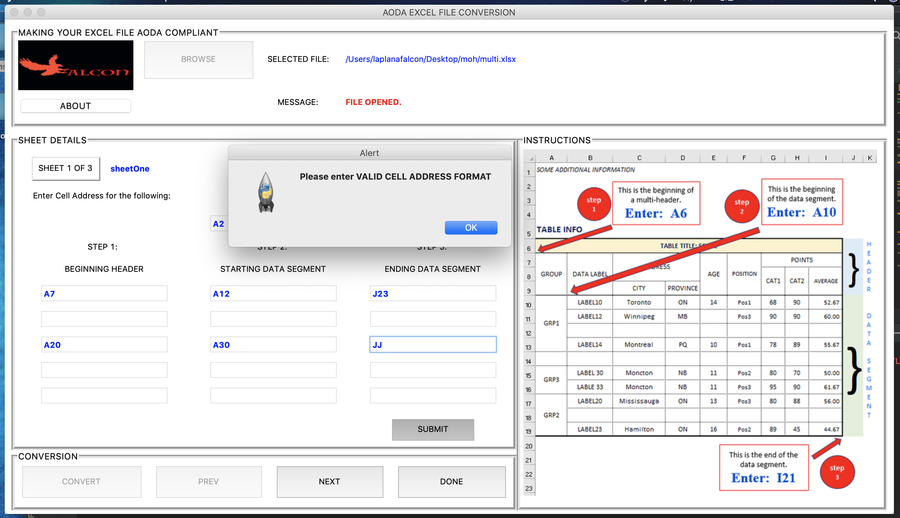

# Excel File AODA Converter

The program takes an Excel file with multiple sheets and multiple tables and convert the file
to an AODA compliant table format.
  
The format conversion is based on specific rules provided by the province of Ontario.
  
INPUT:
* Excel file with multiple sheets and tables

OUTPUT:
* Excel file formatted to be AODA compliant

## Functionalities based on given rules
1. Translates all formulas to its value
2. Un-merges merged cells
3. Deletes any empty rows
4. Updates header locations affected by deleted rows
5. Updates un-merged cell locations affected by deleted rows
6. Inserts "End of Column" appropriately
7. Copies merged content across previous merged cell range
8. Moves all appropriate column headers to the same row as title header
9. Leaves blank cells inside Table as empty cells
10. Converts Table into an "Excel Table Format
11. Formats Table with borders and alignment
12. Updates "Screen Reader" text
13. Writes "No Data" text on empty cells outside table boundaries

## GUI

## User Interface Description
* Convert: Triggers the conversion process
* PREV: Allows user to go back to previous sheets for processing
* NEXT: Allows user to skip ahead / continue with next sheet
* DONE: Allows user to process another file or quit the app

